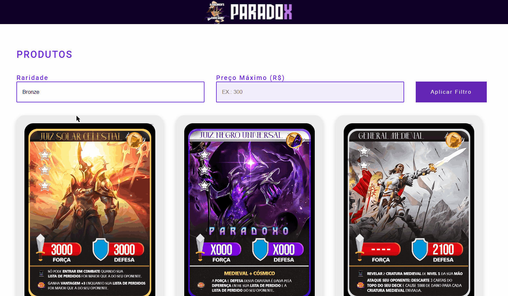

# Projeto de Venda de Cartas
Este projeto foi criado como uma demonstração de um site de venda de cartas, utilizando **HTML**, **CSS** e **JavaScript**. ✨  
A função principal é mostrar a capacidade de filtrar as cartas à venda com base em dois critérios principais: **Raridade** e **Preço**.

## Tecnologias utilizadas
- HTML
- CSS
- JS

## Como utilizar

### Aplicando os Filtros:

**1. Escolha os filtros desejados**:
- Selecione a raridade das cartas disponíveis.

- Selecione um preço máximo que gostaria de encontrar por carta.

**2. Clique em "Aplicar Filtro"**: As cartas serão automaticamente filtradas com base nas suas seleções.